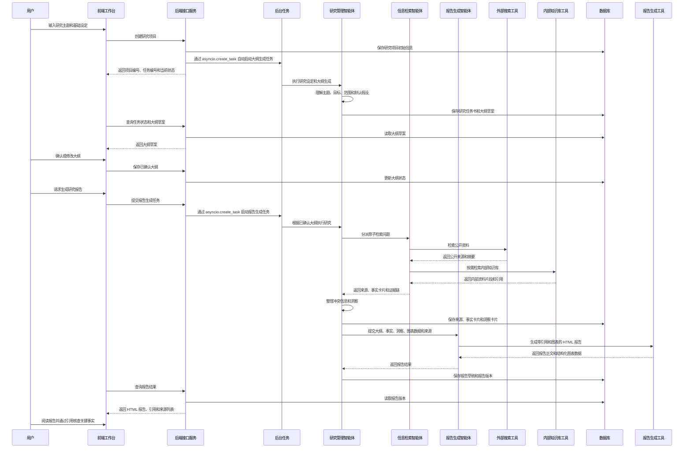
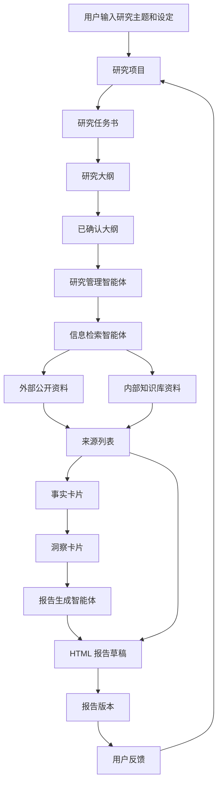

# 系统时序图与关键数据流

## 1. 设计目标

本文档描述第一版系统从“创建研究项目”到“生成 HTML 研究报告”的关键时序和数据流。

第一版设计原则：

- 不引入独立工作流引擎。
- 第一版实现三个智能体：研究管理智能体、信息检索智能体、报告生成智能体。
- 研究管理智能体作为 DeepAgents 主智能体，负责调用另外两个智能体和普通工具。
- FastAPI 负责接口、状态查询和结果保存。
- 第一版使用 FastAPI 的 `asyncio.create_task` 启动后台任务，任务状态保存到 MongoDB。
- MongoDB 保存研究项目、任务书、大纲、事实卡片、洞察卡片和报告版本。
- RAGFlow 只作为内部知识库检索能力，不作为研究产品本身。

## 2. 系统整体时序图

## 3. 关键数据流图

## 4. 第一版关键状态

研究项目状态：

- `created`：项目已创建。
- `brief_generating`：研究任务书和大纲生成中。
- `outline_ready`：大纲草案已生成，等待用户确认。
- `outline_confirmed`：用户已确认大纲。
- `research_running`：研究管理智能体正在协调信息检索和分析。
- `report_ready`：报告草稿已生成。
- `completed`：用户完成修订或归档。

任务状态：

- `queued`：任务已进入队列。
- `running`：任务执行中。
- `succeeded`：任务成功完成。
- `failed`：任务失败。

## 5. 用户介入点

第一版只保留一个强制介入点：

- 大纲确认。

非强制介入点：

- 用户可以在研究设定阶段补充目标、范围和读者。
- 用户可以在资料收集后查看来源列表，但不需要逐条确认事实。
- 用户可以在最终报告阶段通过引用核查关键事实，并修改报告内容。

## 6. 为什么第一版不引入独立任务队列

第一版不引入 Celery、Redis 这类独立任务队列。

研究任务书、大纲生成和报告生成都可能涉及 LLM 调用、外部搜索、网页读取、RAGFlow 检索和报告渲染。如果放在 HTTP 请求里同步执行，会带来几个问题：

- 请求时间太长，前端容易超时。
- 用户刷新页面后，任务状态难以恢复。
- 前端无法稳定展示“排队中、执行中、失败、完成”等状态。

因此第一版使用 FastAPI 的 `asyncio.create_task` 在 API 进程内启动后台任务，并把任务状态保存到 MongoDB。

接口服务只负责：

- 创建项目。
- 保存初始状态。
- 创建任务状态记录。
- 启动后台任务。
- 返回项目编号和任务编号。

后台任务负责：

- 更新任务状态。
- 调用研究管理智能体。
- 保存研究任务书、大纲、事实卡片、洞察和报告。

这个方案的限制：

- API 进程重启时，正在执行的后台任务可能中断。
- 不适合大量并发长任务。
- 不适合多 API worker 同时承载后台任务。
- 失败重试需要后续补充。

当系统进入多人并发使用、需要独立扩容 Worker、需要任务可靠恢复时，再引入 Celery 或 Dramatiq。

这不是独立工作流引擎。后台任务只解决异步执行和状态更新问题，不负责定义研究流程。

# 
