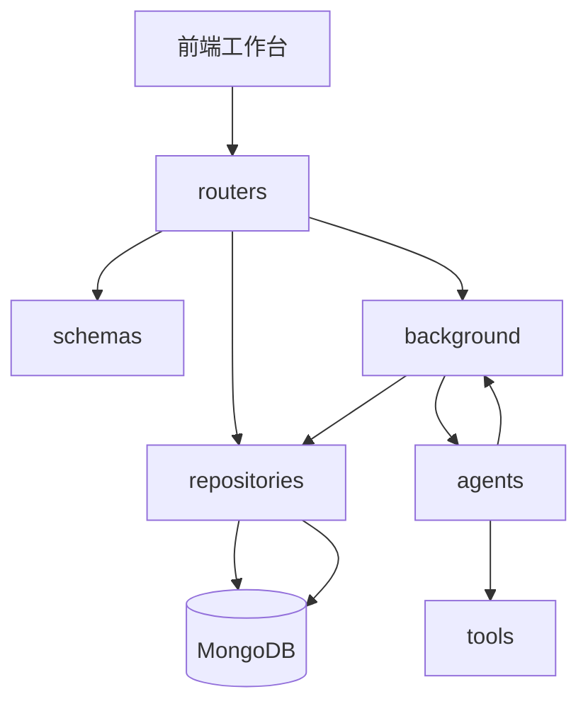
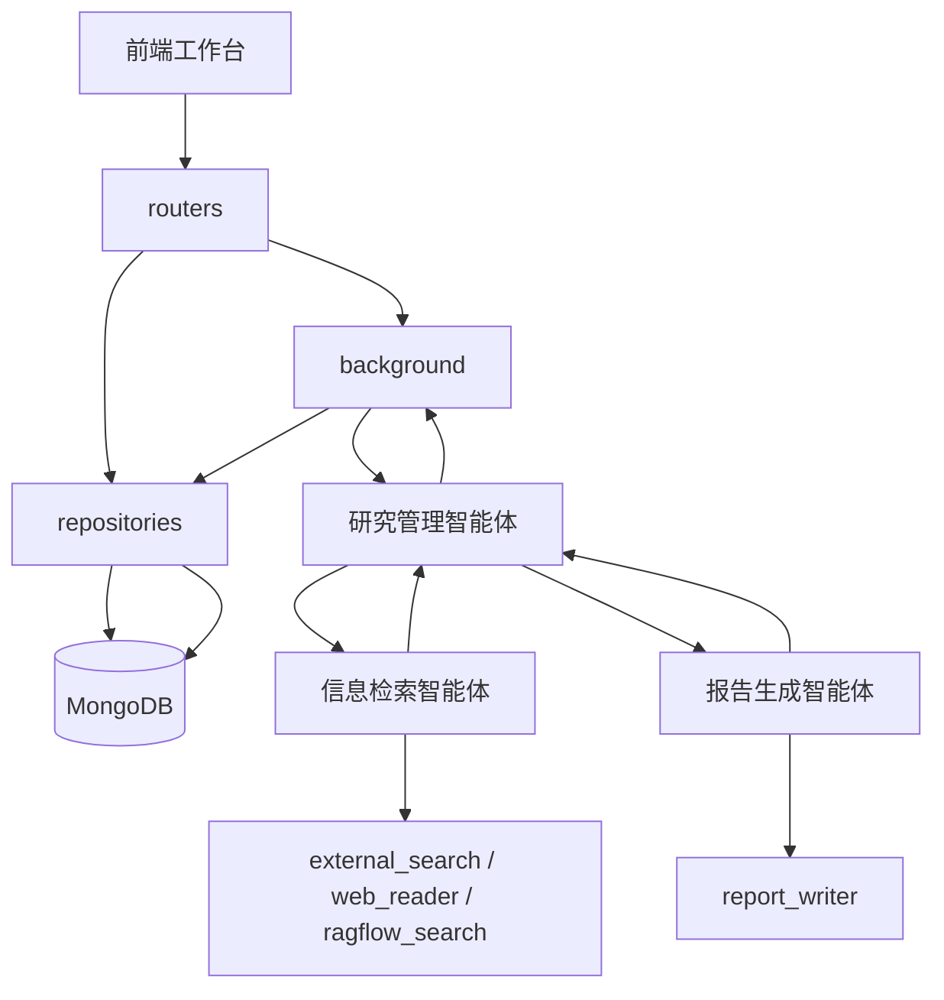

# 模块设计

## 1. 设计目标

模块设计服务于第一版 MVP，不追求一次性完整平台化。

第一版核心目标是跑通：

> 用户创建研究项目 -> 系统自动生成研究任务书和大纲 -> 用户确认大纲 -> 三个智能体协作执行研究 -> 生成带引用的 HTML 报告。

## 2. 后端模块划分

```text
app
  routers
    research_projects.py
    research_tasks.py
    reports.py
  schemas
    research_project.py
    research_task.py
    report.py
  config
    config.py
  agents
    research_agent.py
  tools
    external_search.py
    web_reader.py
    ragflow_search.py
    report_writer.py
  repositories
    research_project_repository.py
    research_task_repository.py
    report_repository.py
  background
    research_tasks.py
```

第一版不需要一次性创建所有文件。编码时按功能推进，每次只新增必要文件。

## 3. 模块职责

### 3.1 `routers`

`routers` 模块负责 HTTP 接口。

职责：

- 接收前端请求。
- 使用 Pydantic Schema 校验请求和响应。
- 调用仓储模块保存或读取数据。
- 在创建研究项目后调用 `background` 模块启动研究任务书和大纲生成任务。
- 在用户确认大纲后调用 `background` 模块启动报告生成任务。
- 返回任务编号、项目状态和报告结果。

不负责：

- 不直接执行 Agent 长任务。
- 不直接调用 `asyncio.create_task`。
- 不写复杂业务逻辑。
- 不直接拼接 Prompt。

### 3.2 `schemas`

`schemas` 模块负责当前项目当中的所有数据结构的维护，使用BaseModel来进行定义。

职责：

- 定义请求结构。
- 定义响应结构。
- 定义稳定枚举和状态常量。
- 定义LLM结构化输出的输出结构。
- 保证接口输入输出清晰。

不负责：

- 不访问数据库。
- 不调用 Agent。
- 不调用外部工具。

### 3.3 `config`

`config` 模块负责系统基础配置。

职责：

- 读取环境变量。
- 管理 API 前缀、环境名称、模型配置、数据库地址、RAGFlow 地址等基础配置。

不负责：

- 不保存业务状态。
- 不封装业务逻辑。

### 3.4 `agents`

`agents` 模块负责三个智能体的构建（服务启动时，构建好所有智能体，也包括LLM的构建，使用ChatOpenAI，ChatDeepSeek等，MVP版本就先这么设计，agents提供统一的初始化方法，放在fastapi的life_span当中），启动，以及调用过程当中的一些容错设置等过程。

职责：

- 构建研究管理智能体。
- 构建信息检索智能体。
- 构建报告生成智能体。
- 维护三个智能体的 Prompt（不放在代码里面，只是说prompt的配置文件，放在agents/prompts目录下面，例如agents/prompts/research_mamager.md等）。
- 由研究管理智能体组织子智能体和工具调用。
- 生成研究任务书、大纲、事实卡片、洞察和报告草稿。

不负责：

- 不直接处理 HTTP 请求。
- 不直接管理数据库连接。
- 不直接执行长时间 Agent 任务。

### 3.5 `tools`
`tools` 模块负责智能体可调用的普通工具，使用langchain的@tool来进行定义。

第一版工具：

- `external_search.py`：公开互联网检索。
- `web_reader.py`：网页正文读取和来源提取。
- `ragflow_search.py`：调用 RAGFlow 检索内部知识库。
- `report_writer.py`：生成 HTML 报告。

工具设计要求：

- 输入输出必须结构化。
- 工具内部可以调用外部服务。
- 工具返回结果必须包含来源信息。
- 工具不保存长期业务数据。

### 3.6 `repositories`

`repositories` 模块负责:构建mongodb的连接，以及数据库读写。

职责：

- 保存研究项目。
- 保存任务状态。
- 保存研究任务书和大纲。
- 保存来源、事实卡片、洞察卡片。
- 保存报告版本。

不负责：

- 不调用 LLM。
- 不调用搜索工具。
- 不处理 HTTP 请求。

### 3.7 `background`

`background` 模块负责 API 进程内后台任务的管理。

职责：

- 封装 `asyncio.create_task` 的调用。
- 创建后台任务执行入口。
- 执行自动创建的研究任务书和大纲生成任务。
- 执行报告生成任务。
- 更新任务状态。

不负责：

- 不定义 HTTP 接口。
- 不直接组织前端响应。
- 不实现独立任务队列。

## 4. 模块调用关系

### 4.1 创建研究项目并自动生成大纲



流程说明：

- `routers` 接收创建研究项目请求。
- `schemas` 负责请求和响应结构。
- `repositories` 保存研究项目和初始任务状态。
- `routers` 调用 `background` 启动大纲生成任务。
- `background` 内部使用 `asyncio.create_task`，并调用 `agents` 执行研究任务书和大纲生成。
- `agents` 按需调用 `tools`。
- `background` 将任务结果交给 `repositories` 保存。

### 4.2 用户确认大纲后生成报告



流程说明：

- `routers` 接收报告生成请求。
- `repositories` 读取已确认大纲和项目状态。
- `routers` 调用 `background` 启动报告生成任务。
- `background` 调用研究管理智能体。
- 研究管理智能体调用信息检索智能体完成资料检索和证据整理。
- 研究管理智能体调用报告生成智能体生成 HTML 报告。
- `background` 将报告草稿、来源列表和任务状态保存到数据库。

## 5. 编码约束

后续编码必须遵守：

- 每次只新增或修改 2-3 个核心代码文件。
- 不要提前创建空模块。
- 不要为了未来可能需要而抽象。
- 不要拆超过三个 Agent。
- 不要引入独立工作流引擎。
- Prompt 放外部配置，不写死在业务代码中。
- 核心方法、类和函数必须有中文注释。

## 6. 未来扩展方向

1. background模块中，使用Celery来代替asyncio.create_task，routers层代码不需要变动。
2. agents模块中，可以添加智能体，或者使用skills等，routers层和background层，都不需要变动。
