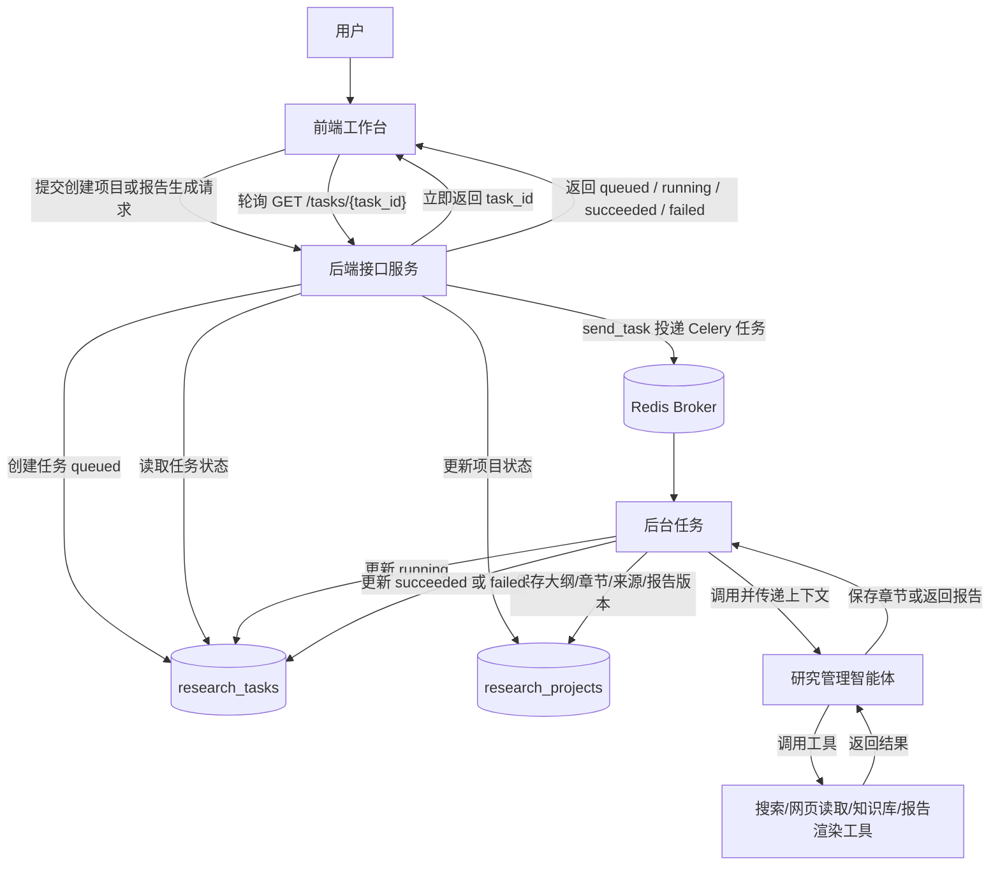
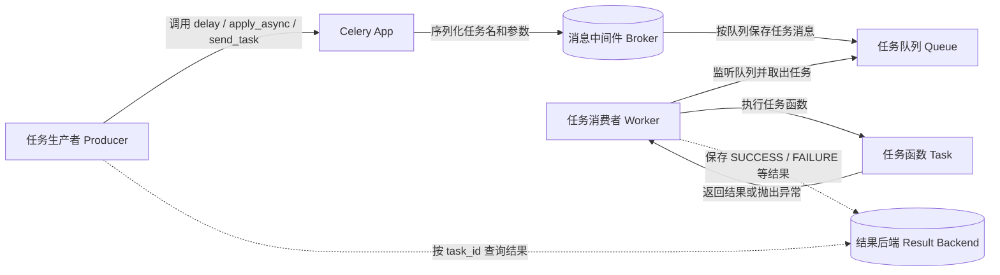
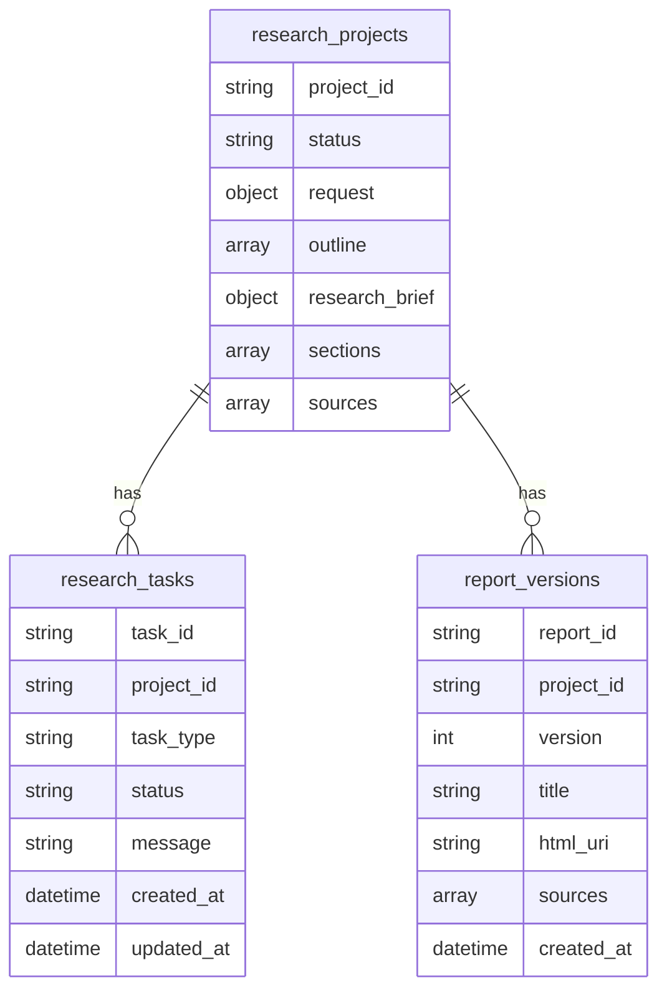

# 异步任务和数据存储

上一节已经初步将项目骨架搭建完毕：定义好了系统调用时序图、接口设计、Schema 结构和 FastAPI 路由入口。接下来，需要让这个系统具备两个能力：

1. 长耗时任务不能阻塞接口请求，要放到后台执行。

2. 项目、任务和报告结果不能只存在内存中，要持久化保存。

这两个能力对应本节的两个主题：

- 异步任务：解决“用户提交任务后，接口如何立即返回，后台如何继续执行”的问题。

- 数据存储：解决“项目状态、任务状态、大纲、研究结果和报告版本如何沉淀”的问题。

## 1. 异步任务

### 1.1 异步任务介绍

本项目中，创建大纲和具体研究过程都是长耗时任务。如果这些过程放在前台接口中同步执行，就会出现几个问题：

1. HTTP 请求会长时间等待，用户体验很差。

2. 搜索、网页读取、LLM 调用可能持续几十秒甚至几分钟，请求容易超时。

3. 如果中间失败，前端很难知道失败发生在哪个阶段。

4. 用户刷新页面后，系统必须还能查到任务当前状态。

因此，这些过程需要通过异步任务来实现：用户创建任务之后，接口立即返回；任务在后台执行；前端通过轮询任务状态接口，检测当前任务是否处理完成。

这也正是当前系统和普通对话系统不同的点：普通对话系统主要维护用户和 LLM 的历史对话记录；而当前系统维护的是多个用户提交的研究项目、多个后台任务，以及这些任务在不同时刻的状态。

异步任务的基本执行过程如下：



这个流程中，接口返回的不是最终报告，而是一个任务编号。任务编号是前端继续查询进度的依据。

例如，用户创建研究项目后，接口返回：

```json
{
  "project_id": "项目编号",
  "initial_task_id": "任务编号",
  "status": "brief_generating",
  "next_step": "wait_for_outline"
}
```

前端拿到 `initial_task_id` 后，可以调用：

```http
GET /api/v1/tasks/{task_id}
```

后台任务执行完成后，任务状态会从 `queued` 变成 `running`，最后变成 `succeeded` 或 `failed`。

### 1.2 创建异步任务的方式

#### 1.2.1 asyncio.create_task()

通过 `asyncio.create_task()`，可以将一个协程提交到当前事件循环中执行，避免阻塞当前请求处理流程。

准确地说，`asyncio.create_task()` 需要在已经运行的事件循环中调用。在 FastAPI 的异步接口和异步后台流程中，当前进程已经有事件循环，因此可以直接使用它提交协程任务。

先看一个最小示例：

```python
import asyncio

async def fetch_data(name, delay):
    print(f"{name}: 开始")
    await asyncio.sleep(delay)
    print(f"{name}: 结束")
    return name

async def demo_await():
    print("=== await 方式 ===")
    result = await fetch_data("A", 2)   # 开始执行 A，并等待 2 秒
    print("主协程拿到结果后继续")
    result = await fetch_data("B", 1)   # 等 A 完成才开始 B
    print("结束")

async def demo_create_task():
    print("=== create_task 方式 ===")
    task_a = asyncio.create_task(fetch_data("A", 2))
    task_b = asyncio.create_task(fetch_data("B", 1))
    print("两个任务已在后台运行，主协程继续")
    await asyncio.sleep(0.5)            # 主协程做其他事
    results = await asyncio.gather(task_a, task_b)  # 等待两者完成
    print("结束")

asyncio.run(demo_await())
asyncio.run(demo_create_task())
```

这段代码体现了 `await` 和 `create_task` 的区别：

| 写法                         | 行为                       |
| -------------------------- | ------------------------ |
| `await fetch_data(...)`    | 当前协程会等待这个任务执行完成，然后再继续往下走 |
| `asyncio.create_task(...)` | 把协程提交到事件循环中，当前协程可以继续往下走  |

#### 1.2.2 使用 Celery 框架

当前项目使用 Celery 这类任务队列框架来实现异步任务。使用 Celery，可以将任务创建过程和任务处理过程解耦：FastAPI 负责创建项目和投递任务，Celery worker 负责真正执行 Agent 长任务。

进程内 `asyncio.create_task` 和 Celery 的区别如下：

| 方案                    | 优点                           | 局限                                      | 适用阶段   |
| --------------------- | ---------------------------- | --------------------------------------- | ------ |
| `asyncio.create_task` | 简单、没有额外组件、适合讲清异步基本思想         | API 进程重启后，正在执行的任务会丢失；不适合多实例任务调度         | 教学对比方案 |
| Celery                | 任务可排队、worker 可独立运行、任务投递和执行解耦 | 需要 Redis/RabbitMQ 等中间件，启动时多一个 worker 进程 | 当前项目实现 |

Celery当中所包含的角色，及其执行流程，如下所示：




### 1.3 编码

异步任务相关编码主要涉及三个模块：

| 模块            | 文件                                         | 作用                                                         |
| --------------- | -------------------------------------------- | ------------------------------------------------------------ |
| 路由模块        | `app/routers/__init__.py`                    | 接收请求，调用app.background的schedule_task任务，传入task对象和其他参数，来定义后台任务 |
| 后台任务模块    | `app/background/research_tasks.py`           | 定义celery app当中所包含的所有任务（通过@app.task所定义的同步方法），以及各个任务的具体实现逻辑（通过async def 所定义的异步方法） |
| 任务仓储模块    | `app/repository/research_task_repository.py` | 创建任务、查询任务、更新任务状态等                           |
| celery app 模块 | app/celery_app.py                            | 定义celery的app实例对象：中间件的地址和app对应的任务所在的模块 |

#### 1.3.1 路由模块

创建研究项目时，路由层的核心逻辑如下：

```python
# 1、从background.research_task中引入start_xxx方法
from app.background.research_task import start_generate_research_brief_task
task = await _create_task(
    project_id=project_id,
    task_type=TaskType.GENERATE_RESEARCH_BRIEF,
    message="研究任务书和大纲生成任务已创建",
)
await research_project_repository.create_project(
    project_id=project_id,
    request=request,
    topic=request.topic,
    status=ProjectStatus.BRIEF_GENERATING,
    created_at=created_at,
)
# 2、调用研究报告生成任务，此调用为非阻塞式调用
start_generate_research_brief_task(project_id=project_id, task_id=task.task_id)
# 3、直接返回响应
return ResearchProjectCreateResponse(
        project_id=project_id,
        initial_task_id=task.task_id,
        initial_task_type=TaskType.GENERATE_RESEARCH_BRIEF,
        topic=request.topic,
        status=ProjectStatus.BRIEF_GENERATING,
        next_step=NextStep.WAIT_FOR_OUTLINE,
        created_at=created_at,
    )
```

这里有三个动作：

1. 先创建后台任务记录，状态为 `queued`。

2. 再创建研究项目记录，项目状态为 `brief_generating`。

3. 最后启动后台任务，接口立即返回项目编号和任务编号。

#### 1.3.2 后台任务模块

所有任务，定义在`app.background`模块中，该模块暴露顶层的3个任务方法：

- start_generate_research_brief_task

- start_revise_outline_task

- start_generate_report_task

routers调用这些方法创建后台任务。这种隔离的好处是后面对后台任务处理方式的升级，不影响前端的routers模块代码。 

在Celery中，有如下角色，多个角色之间的关系，如下图所示：

这张图需要强调几个角色：

1. Producer 负责任务投递，通常是 Web 服务、脚本或其他业务进程。

2. Broker 负责保存待执行任务消息，常见选择是 Redis 或 RabbitMQ。

3. Worker 负责从队列中取出任务，并在本进程中执行对应的 Task 函数。

4. Result Backend 是可选角色，用于保存任务执行结果和状态，例如 `SUCCESS`、`FAILURE`。

使用Celery进行分布式任务管理时，整体编码的流程如下所示：

1. 构建Celery App：Celery App类似于FastAPI App对象。Celery App包含了Broker地址，和Backend地址，以及任务定义等信息；

2. 定义celery task：将一个函数，定义成一个task；

3. 通过celery app，将task发送到broker当中去。

构建Celery App代码如下所示：

```python
from celery import Celery

from app.config.config import Settings, get_settings


def create_celery_app() -> Celery:
    """创建 Celery 应用实例，供 API 进程投递任务和 worker 进程消费任务。"""

    settings: Settings = get_settings()
    app = Celery(
        "deep_research",
        # 定义broker和backend
        broker=settings.celery_broker_url or settings.redis_url,
        include=["app.background.celery_tasks"],
    )
    app.conf.update(
        task_acks_late=True,
        task_reject_on_worker_lost=True,
        task_track_started=True,
        worker_prefetch_multiplier=1,
        timezone="Asia/Shanghai",
    )
    return app


celery_app = create_celery_app()
```

定义celery的task如下所示：

```python
import asyncio
from collections.abc import Awaitable, Callable
from typing import Any

from app.background import research_tasks
from app.celery_app import celery_app

_work_loop: asyncio.AbstractEventLoop | None = None

def _get_worker_loop() -> asyncio.AbstractEventLoop:
    global _work_loop
    if _work_loop is None:
        _work_loop = asyncio.new_event_loop()
        asyncio.set_event_loop(_work_loop)

    return _work_loop

def _run_async(coroutine_factory: Callable[[], Awaitable[None]]) -> None:
    """在 Celery 的同步 worker 入口中执行异步业务函数。"""
    loop = _get_worker_loop()
    loop.run_until_complete(coroutine_factory())


def _task_options(name: str) -> dict[str, Any]:
    return {
        "name": name,
        "autoretry_for": (Exception,),
        "retry_kwargs": {"max_retries": 3},
        "retry_backoff": True,
        "retry_jitter": True,
    }


@celery_app.task(**_task_options("research.generate_research_brief"))
def generate_research_brief_task(project_id: str, task_id: str) -> None:
    _run_async(
        lambda: research_tasks.run_generate_research_brief_task(
            project_id=project_id,
            task_id=task_id,
        )
    )


@celery_app.task(**_task_options("research.revise_outline"))
def revise_outline_task(project_id: str, task_id: str, revision_instruction: str) -> None:
    _run_async(
        lambda: research_tasks.run_revise_outline_task(
            project_id=project_id,
            task_id=task_id,
            revision_instruction=revision_instruction,
        )
    )


@celery_app.task(**_task_options("research.generate_report"))
def generate_report_task(
    project_id: str,
    task_id: str,
    user_instruction: str | None,
) -> None:
    _run_async(
        lambda: research_tasks.run_generate_report_task(
            project_id=project_id,
            task_id=task_id,
            user_instruction=user_instruction,
        )
    )


@celery_app.task(**_task_options("research.render_report"))
def render_report_task(
    project_id: str,
    task_id: str,
    user_instruction: str | None,
) -> None:
    _run_async(
        lambda: research_tasks.run_render_report_task(
            project_id=project_id,
            task_id=task_id,
            user_instruction=user_instruction,
        )
    )
```

将task通过app发送到broker当中：

```python
def start_generate_research_brief_task(project_id: str, task_id: str) -> None:
    """启动研究任务书和大纲生成后台任务。

    输入为研究项目编号和后台任务编号；该函数只负责把任务提交到celery 的broker中，
    供给celery worker进行消费。
    """

    _send_task(
        task_path="research.generate_research_brief",
        task_name="generate_research_brief",
        project_id=project_id,
        task_id=task_id,
        args=(project_id, task_id),
    )
def _send_task(
    task_path: str,
    task_name: str,
    project_id: str,
    task_id: str,
    args: tuple[Any, ...],
) -> None:
    """把后台任务投递到 Celery 队列。

    输入为 Celery 任务路径、任务名称、项目编号和任务参数；输出为空。该函数隔离
    Celery 投递细节，保证 routers 层不直接依赖具体的后台任务启动方式。
    """

    from app.celery_app import celery_app

    celery_app.send_task(task_path, args=args)
    logger.info(
        "后台任务已投递到 Celery，task_name={}，project_id={}，task_id={}",
        task_name,
        project_id,
        task_id,
    )
```

启动Celery Worker命令如下：

```bash
.venv/bin/celery -A app.celery_app:celery_app worker -l INFO -P solo
```

## 2. 数据存储

### 2.1 数据存储概述

本项目中，需要持久化存储的数据有如下几类：

- 项目状态和项目基础数据。

- 任务状态和任务执行信息。

- 研究任务书和研究大纲。

- 研究过程产物，包括研究任务书、大纲、已确认大纲、章节结果和项目级去重来源。

- 报告相关数据，包括报告版本、HTML 存储位置和来源列表。

这些数据存在大量嵌套结构。例如，一个研究项目下面会包含大纲树、确认后的大纲、逐章节研究结果和项目级来源列表。

传统关系型数据库中二维表的平铺结构不适合存储该类数据，因此，本项目选择使用**文档数据库**作为数据存储方案。

#### 2.1.1 文档数据库介绍

文档数据库是一种**非关系型数据库（NoSQL）**，它使用**文档**（Document）作为数据存储的基本单位，而不是传统关系型数据库中的“行”和“列”。

可以把文档理解为一个**自包含的、结构灵活的数据对象**，最常见的表示格式是 **JSON**，在 MongoDB 中实际存储为 BSON。比如，一本书的信息、一个用户的资料、一个研究项目的数据，都可以存成一个文档。

关系型数据库和文档数据库的对比：

| 特性             | 关系型数据库                           | 文档数据库                                             |
| ---------------- | -------------------------------------- | ------------------------------------------------------ |
| 基本存储单位     | 表中的一行                             | 一个文档                                               |
| 数据模型         | 严格、预先定义表结构，列和数据类型固定 | 灵活、动态的结构，文档内字段可以按业务扩展             |
| 数据关系         | 通过外键关联多个表，查询时常用 JOIN    | 尽量把强相关数据保存在同一个文档中，减少跨表关联       |
| 一个用户数据示例 | 需要拆到用户表、地址表、订单表         | 一个 JSON 文档可以包含用户基本信息、地址列表和最近订单 |
| 适合场景         | 强事务、强关系、复杂联表查询           | 结构嵌套、字段变化快、读写以单个业务对象为中心         |
| 典型代表         | **MySQL**                              | **Mongo**                                              |

#### 2.1.2 MongoDB介绍

MongoDB 是一种常用的文档型数据库，支持文档存储、索引、聚合查询、分布式部署等能力。

MongoDB 中几个基本概念如下：

| 概念       | 含义     | 类比关系型数据库 |
| ---------- | -------- | ---------------- |
| database   | 数据库   | database         |
| collection | 集合     | table            |
| document   | 文档     | row              |
| field      | 字段     | column           |
| `_id`      | 文档主键 | primary key      |

本项目通过docker启动MongoDB数据库服务，在项目中通过客户端进行连接。

MongoDB 的使用不会直接写在路由函数中，而是封装在 repository 层。这样做的目的，是让接口层保持清晰

### 2.2 项目数据结构设计

可以将当前系统所需要存储的数据，拆分成如下三个集合：

当前系统主要包含三个集合：

| 集合                | 保存内容                                                     | 对应仓储模块                     |
| ------------------- | ------------------------------------------------------------ | -------------------------------- |
| `research_projects` | 项目基础信息、项目状态、研究任务书、大纲、章节结果、项目级来源 | `research_project_repository.py` |
| `research_tasks`    | 后台任务编号、任务类型、任务状态、状态说明和时间             | `research_task_repository.py`    |
| `report_versions`   | 报告版本、标题、HTML 存储地址、来源列表                      | `report_repository.py`           |

数据之间的关系为：



#### 2.2.1 research_projects集合

research_projects是保存整个研究项目中所有研究数据的集合。当中，各个字段的名称，及其含义，如下所示：

| 字段名称       | 字段类型      | 字段含义                               |
| -------------- | ------------- | -------------------------------------- |
| project_id     | string        | 新建项目时的id，使用uuid来存储         |
| status         | string        | 项目的状态，表示当前项目处于哪一个阶段 |
| request        | string        | 用户的request                          |
| outline        | array[object] | 嵌套的大纲                             |
| research_brief | object        | 研究任务书                             |
| sections       | array[object] | 智能体生成的，各个章节的内容           |
| sources        | array[object] | 所有的来源信息                         |

outline、research_brief、sections、sources，都是嵌套结构。

##### 2.2.1.1 outline内部结构

outline数组当中，包含的各个大纲节点，结构如下：

| 字段名称    | 字段类型 | 字段含义               |
| ----------- | -------- | ---------------------- |
| node_id     | string   | 章节编号               |
| title       | string   | 章节标题               |
| question    | string   | 该章节所需要回答的问题 |
| description | string   | 该章节作用描述         |
| children    | array    | 该章节所包含的子章节   |

##### 2.2.1.2 research_brief内部结构

research_brief 是智能体基于用户基础研究设定生成的结构化任务书，通常与大纲一起生成。它主要用于沉淀智能体对研究目标、范围、受众和关键问题的理解，帮助后续修订大纲和逐章节生成内容时保持方向一致。outline/confirmed_outline 决定报告章节结构，research_brief 决定研究方向和约束。

research_brief所包含的字段及其含义如下：

| 字段名称         | 字段类型 | 字段含义                                                   |
| ---------------- | -------- | ---------------------------------------------------------- |
| topic            | string   | 研究主题。说明这次研究围绕什么对象或问题展开               |
| research_goal    | string   | 研究目标。说明最终要回答什么业务问题、支持什么决策         |
| target_audience  | string   | 目标读者。说明报告主要给谁看，比如管理层、战略部、产品团队 |
| scope_summary    | string   | 研究范围摘要。说明地域、时间、行业边界、重点关注内容       |
| key_questions    | array    | 关键研究问题列表。后续大纲和章节内容应该围绕这些问题展开   |
| assumptions      | array    | 研究假设列表。说明生成报告时默认成立的前提条件             |
| success_criteria | array    | 成功标准列表。说明什么样的报告结果算完成了本次研究目标     |

##### 2.2.1.3 sections内部结构

sections数组，是由智能体所产出的，多个不同的章节内容。**后面的报告，就是通过sections内容进行渲染，得到最终的HTML内容**。

单个section内部构造如下：

| 字段名称     | 字段类型 | 字段含义                   |
| ------------ | -------- | -------------------------- |
| section_id   | string   | 章节ID                     |
| title        | string   | 章节的标题                 |
| summary      | string   | 该章节的摘要信息           |
| body         | string   | 完整章节内容               |
| key_findings | array    | 该章节的关键发现           |
| sources      | array    | 该章节所依赖的信息来源列表 |
| tables       | array    | 该章节所产出的表格         |
| risks        | array    | 该章节相关的风险内容       |

##### 2.2.1.4 sources内部结构

| 字段名称     | 字段类型 | 字段含义                                                     |
| ------------ | -------- | ------------------------------------------------------------ |
| source_id    | string   | 项目全局的来源ID                                             |
| title        | string   | 来源标题                                                     |
| url          | string   | 来源链接                                                     |
| published_at | string   | 发布日期                                                     |
| source_type  | string   | 来源类型，智能体根据具体内容判断后填充，有official_document、industry_report、news、public_web、internal_knowledge_base内部知识库、unknown等值 |
| summary      | string   | 来源摘要。该信息的简要摘要                                   |

#### 2.2.2 research_task集合

research_task是保存 研究过程中，异步任务元数据信息的集合。

其内部所包含的字段，及其含义如下：

| 字段名称   | 字段类型 | 字段含义                                                     |
| ---------- | -------- | ------------------------------------------------------------ |
| task_id    | string   | 当前任务的id                                                 |
| project_id | string   | 当前任务所对应的项目的id                                     |
| task_type  | string   | 当前任务的类型，有三种不同类型的任务                         |
| status     | string   | 当前任务的状态                                               |
| message    | string   | 后台任务当前状态的文字说明，主要给前端轮询任务时展示，也用于失败时保存简短错误摘要 |
| created_at | datetime | 当前任务的创建时间                                           |
| updated_at | datetime | 当前任务数据更新时间                                         |

#### 2.2.3 report_versions集合

report_versions 是最终报告版本集合。一条记录代表某个项目的一版 HTML 报告。每次重新生成或重新渲染报告，都会插入一条新版本，而不是覆盖旧版本。

其包含的各个字段，及其含义，如下所示：

| 字段名称   | 字段类型 | 字段含义                                                     |
| ---------- | -------- | ------------------------------------------------------------ |
| report_id  | string   | 报告的id                                                     |
| project_id | string   | 报告所对应的项目id                                           |
| version    | int      | 报告所对应的版本                                             |
| title      | string   | 报告的标题                                                   |
| html_uri   | string   | HTML正文存储的uri。报告可以存储在本地文件系统，或在实际生产环境下，存储在OSS（对象存储服务）当中 |
| sources    | array    | 该报告所包含的所有来源信息                                   |
| created_at | datetime | 该报告的产出时间                                             |

### 2.3 编码

数据存储的编码包含两部分内容：

1. mongodb 客户端初始化的编码
2. 三个repository（research_project_repository、research_task_repository、report_repository）的具体编码

#### 2.3.1 MongoDB客户端初始化

本项目使用pymongo包所提供的AsyncMongoClient作为客户端对象。

初始化代码如下所示：

```python
from pymongo.asynchronous.database import 
AsyncDatabase
_mongodb_client: AsyncMongoClient | None = None
def get_mongodb_client() -> AsyncMongoClient:
    global _mongodb_client
    if _mongodb_client is None:
        settings: Settings = get_settings()
        _mongodb_client = AsyncMongoClient(
        	settings.mongodb_uri,
        )
	return _mongodb_client

def get_mongodb_database() -> AsyncDatabase:
    
    settings: Settings = get_settings()
    # client[xxx_database],即可获取到对应数据库的client对象
    return get_mongodb_client()[settings.mongodb_database]    
```

#### 2.3.2 MongoDB读写数据操作

MongoDB对数据的增删改查操作，通过调用对应对应collection实例的find_one、insert_one、update_one、delete_one即可。

而要获取对应collection实例，通过前面的get_mongodb_database()获取即可

```python
collection = get_mongodb_database()["research_projects"]
```

##### 2.3.2.1 插入数据

插入数据代码如下：

```python
result = await collection.insert_one({
    "name": "张三",
    "age": 20
})

print(result.inserted_id)
```

##### 2.3.2.2 查找数据

查找数据，调用find_one方法，该方法必须要要传入的参数是查找条件。可选的参数为，查找后要返回的数据字段，如果不传值，则是返回所有字段：

```python
user = collection.find_one(
    {"name": "张三"}, # 查找的条件
    {"name": 1, "age": 1, "_id": 0} # 查找后，指定放回name字段和age字段，不返回_id字段
)
```

##### 2.3.2.3 更新数据

MongoDB对数据的更新，有三种方式：

- set：直接新增某个键，或者覆盖掉数据当中某个键所对应的值
- pull: 删除掉数据当中，值类型为array的键中，符合条件的所有数据
- push：向数据当中值类型为array的键当中，添加一条数据

```python
# 假设某个collection：
#{
#  "name": "张三",
#  "age": 21,
#  "tags": ["程序员", "大模型开发", "男性"]
#}

# set
result = await collection.update_one(
    {"name": "张三"},          # 查询条件
    {"$set": {"age": 21}}     # 修改内容
)

# pull ：删除tags当中为“程序员”的tag
result = await collection.update_one(
    {"name": "张三"},          # 查询条件
    {"$pull": {"tags": "程序员"}}
)


# push：向tags当中添加新的tag:"爱运动"
result = await collection.update_one(
    {"name": "张三"},          # 查询条件
    {"$pull": {"tags": "爱运动"}}
)

print(result.matched_count)
print(result.modified_count)
```

##### 2.3.2.4 删除数据

删除代码如下所示，找到匹配条件的数据，进行删除：

```python
result = collection.delete_one({"name": "张三"})
print(result.deleted_count)
```

#### 2.3.3 三个repository的代码

现在，可以将 `research_project_repository.py`、`research_task_repository.py` 以及 `report_repository.py` 当中的具体实现进行补充。

##### 2.3.3.1 research_project_repository

代码如下：

```python
from datetime import datetime
from typing import Any

from app.repository.mongodb import get_mongodb_database
from app.schemas import (
    OutlineNode,
    ProjectStatus,
    ReportSource,
    ResearchProjectCreate,
    utc_now,
)

COLLECTION_NAME = "research_projects"


def _get_collection():
    """获取研究项目集合对象。

    输入为空，输出为 MongoDB 的 research_projects 集合。数据库连接对象由
    app.repository.mongodb 提供，本模块只负责项目相关读写。
    """

    return get_mongodb_database()[COLLECTION_NAME]


def _clean_document(document: dict[str, Any] | None) -> dict[str, Any] | None:
    """清理 MongoDB 内部字段并恢复稳定枚举字段。

    输入为数据库原始项目文档或 None；输出为业务层可直接使用的 dict 或 None。
    该函数不做业务校验，只处理数据库字段到业务字段的转换。
    """

    if document is None:
        return None
    document.pop("_id", None)
    if "status" in document:
        document["status"] = ProjectStatus(str(document["status"]))
    return document


def _dump_outline(outline: list[OutlineNode] | list[dict[str, Any]]) -> list[dict[str, Any]]:
    """把大纲节点转换为可写入 MongoDB 的字典列表。

    输入为 OutlineNode 列表或字典列表，输出为字典列表。该函数兼容后续 Agent 返回
    Pydantic 结构或普通 dict 的两种情况。
    """

    dumped_outline: list[dict[str, Any]] = []
    for node in outline:
        if isinstance(node, OutlineNode):
            dumped_outline.append(node.model_dump(mode="python"))
        else:
            dumped_outline.append(node)
    return dumped_outline


def _dump_sources(sources: list[ReportSource] | list[dict[str, Any]]) -> list[dict[str, Any]]:
    """把来源列表转换为可写入 MongoDB 的字典列表。"""

    dumped_sources: list[dict[str, Any]] = []
    for source in sources:
        if isinstance(source, ReportSource):
            dumped_sources.append(source.model_dump(mode="python"))
        else:
            dumped_sources.append(source)
    return dumped_sources


async def create_project(
    project_id: str,
    request: ResearchProjectCreate,
    topic: str,
    status: ProjectStatus,
    created_at: datetime,
) -> dict[str, Any]:
    """创建研究项目记录。

    输入为项目编号、创建请求、主题、初始状态和创建时间；输出为写入后的项目文档。
    该函数只负责项目基础信息持久化，不创建任务、不启动 Agent。
    """

    document: dict[str, Any] = {
        "_id": project_id,
        "project_id": project_id,
        "topic": topic,
        "request": request.model_dump(mode="python"),
        "status": status,
        "outline": [],
        "confirmed_outline": [],
        "research_brief": None,
        "sections": [],
        "sources": [],
        "created_at": created_at,
        "updated_at": created_at,
    }
    await _get_collection().insert_one(document)
    return _clean_document(document) or {}


async def get_project(project_id: str) -> dict[str, Any] | None:
    """根据项目编号读取研究项目。

    输入为项目编号，输出为项目文档；项目不存在时返回 None。
    """

    document = await _get_collection().find_one({"project_id": project_id})
    return _clean_document(document)


async def update_project_status(project_id: str, status: ProjectStatus) -> None:
    """更新研究项目主流程状态。

    输入为项目编号和目标状态，输出为空。该函数只更新状态和更新时间。
    """

    await _get_collection().update_one(
        {"project_id": project_id},
        {"$set": {"status": status, "updated_at": utc_now()}},
    )


async def get_outline(project_id: str) -> list[OutlineNode]:
    """读取研究项目当前大纲草案。

    输入为项目编号，输出为大纲节点列表；大纲不存在时返回空列表。
    """

    document = await _get_collection().find_one({"project_id": project_id}, {"outline": 1})
    if document is None:
        return []
    return [OutlineNode.model_validate(node) for node in document.get("outline", [])]


async def get_confirmed_outline(project_id: str) -> list[OutlineNode]:
    """读取研究项目已确认大纲。

    输入为项目编号，输出为已确认大纲节点列表；如果 confirmed_outline 尚未单独保存，
    则回退读取 outline 字段。
    """

    document = await _get_collection().find_one(
        {"project_id": project_id},
        {"outline": 1, "confirmed_outline": 1},
    )
    if document is None:
        return []
    outline = document.get("confirmed_outline") or document.get("outline", [])
    return [OutlineNode.model_validate(node) for node in outline]


async def save_research_brief_and_outline(
    project_id: str,
    research_brief: Any,
    outline: list[OutlineNode] | list[dict[str, Any]],
) -> None:
    """保存研究任务书和大纲草案。

    输入为项目编号、研究任务书和大纲节点列表，输出为空。该函数用于大纲生成任务
    完成后的结果落库。
    """

    await _get_collection().update_one(
        {"project_id": project_id},
        {
            "$set": {
                "research_brief": _dump_value(research_brief),
                "outline": _dump_outline(outline),
                "updated_at": utc_now(),
            }
        },
    )


async def save_outline(
    project_id: str,
    outline: list[OutlineNode] | list[dict[str, Any]],
) -> None:
    """保存研究大纲草案。

    输入为项目编号和大纲节点列表，输出为空。该函数用于大纲修改任务完成后覆盖
    当前大纲草案。
    """

    await _get_collection().update_one(
        {"project_id": project_id},
        {"$set": {"outline": _dump_outline(outline), "updated_at": utc_now()}},
    )


async def save_confirmed_outline(
    project_id: str,
    outline: list[OutlineNode] | list[dict[str, Any]],
) -> None:
    """保存用户确认后的研究大纲。

    输入为项目编号和大纲节点列表，输出为空。当前 router 只更新项目状态，后续如果
    需要保留确认快照，可以调用该函数写入 confirmed_outline。
    """

    await _get_collection().update_one(
        {"project_id": project_id},
        {"$set": {"confirmed_outline": _dump_outline(outline), "updated_at": utc_now()}},
    )


async def clear_research_sections(project_id: str) -> None:
    """清空研究章节草稿。

    输入为项目编号，输出为空。该函数在重新执行报告研究任务前调用，避免旧章节或占位
    章节混入本次研究结果。
    """

    await _get_collection().update_one(
        {"project_id": project_id},
        {
            "$set": {
                "sections": [],
                "sources": [],
                "updated_at": utc_now(),
            }
        },
    )


async def upsert_research_section(project_id: str, section: dict[str, Any]) -> None:
    """按 section_id 保存或覆盖单个研究章节。

    输入为项目编号和已通过校验的 ResearchSection 字典，输出为空。该方法用于主研究
    智能体逐章节落库，避免最后一次性解析大 JSON。
    """

    section_id = section.get("section_id")
    await _get_collection().update_one(
        {"project_id": project_id},
        {"$pull": {"sections": {"section_id": section_id}}},
    )
    await _get_collection().update_one(
        {"project_id": project_id},
        {"$push": {"sections": section}, "$set": {"updated_at": utc_now()}},
    )


async def upsert_research_sources(project_id: str, sources: list[dict[str, Any]]) -> None:
    """按 URL 优先合并保存全项目研究来源。

    source_id 可能是主智能体每个章节内从 source-1 重新开始的局部编号，不能作为
    跨章节去重键。有 URL 时按 URL 去重；无 URL 时用 source_type/title 兜底。
    """

    now = utc_now()
    for source in sources:
        source_key = _source_dedupe_key(source)
        if source_key is None:
            continue
        source_filter = (
            {"url": source_key}
            if source.get("url")
            else {
                "url": {"$in": [None, ""]},
                "source_type": source.get("source_type"),
                "title": source.get("title"),
            }
        )
        await _get_collection().update_one(
            {"project_id": project_id},
            {"$pull": {"sources": source_filter}},
        )
        await _get_collection().update_one(
            {"project_id": project_id},
            {"$push": {"sources": source}, "$set": {"updated_at": now}},
        )


def _source_dedupe_key(source: dict[str, Any]) -> str | None:
    url = str(source.get("url") or "").strip()
    if url:
        return url
    title = str(source.get("title") or "").strip()
    source_type = str(source.get("source_type") or "").strip()
    if not title:
        return None
    return f"{source_type}:{title}"


async def get_research_sections(project_id: str) -> list[dict[str, Any]]:
    """读取当前项目已落库的研究章节。

    输入为项目编号，输出为 ResearchSection 字典列表。返回值按 section_id 字符串排序，
    让报告渲染阶段得到稳定章节顺序。
    """

    document = await _get_collection().find_one({"project_id": project_id}, {"sections": 1})
    if document is None:
        return []
    sections = [section for section in document.get("sections", []) if isinstance(section, dict)]
    return sorted(sections, key=lambda section: str(section.get("section_id") or ""))


async def get_research_sources(project_id: str) -> list[dict[str, Any]]:
    """读取当前项目已去重的研究来源。"""

    document = await _get_collection().find_one({"project_id": project_id}, {"sources": 1})
    if document is None:
        return []
    return [source for source in document.get("sources", []) if isinstance(source, dict)]


def _dump_value(value: Any) -> Any:
    """把 Pydantic 对象或普通对象转换为可保存的值。

    输入为任意值，输出为 MongoDB 可保存的基础结构。该函数主要兼容 Agent 结构化
    输出对象，不承担业务字段校验。
    """

    if hasattr(value, "model_dump"):
        return value.model_dump(mode="python")
    return value

```

大纲生成完成后，需要保存研究任务书和大纲：

```python
async def save_research_brief_and_outline(
    project_id: str,
    research_brief: Any,
    outline: list[OutlineNode] | list[dict[str, Any]],
) -> None:
    await _get_collection().update_one(
        {"project_id": project_id},
        {
            "$set": {
                "research_brief": _dump_value(research_brief),
                "outline": _dump_outline(outline),
                "updated_at": utc_now(),
            }
        },
    )
```

用户确认大纲后，需要保存确认快照：

```python
async def save_confirmed_outline(
    project_id: str,
    outline: list[OutlineNode] | list[dict[str, Any]],
) -> None:
    await _get_collection().update_one(
        {"project_id": project_id},
        {"$set": {"confirmed_outline": _dump_outline(outline), "updated_at": utc_now()}},
    )
```

##### 2.3.3.2 research_task_repository

核心代码如下：

```python
from datetime import datetime

from app.repository.mongodb import get_mongodb_database
from app.schemas import TaskStatus, TaskStatusResponse, TaskType, utc_now

COLLECTION_NAME = "research_tasks"


def _get_collection():
    """获取研究任务集合对象。

    输入为空，输出为 MongoDB 的 research_tasks 集合。数据库连接对象由
    app.repository.mongodb 提供，本模块只负责使用连接对象进行任务读写。
    """

    return get_mongodb_database()[COLLECTION_NAME]


def _task_from_document(document: dict[str, object] | None) -> TaskStatusResponse | None:
    """把数据库任务文档转换为接口任务状态结构。

    输入为 MongoDB 返回的任务文档或 None；输出为 TaskStatusResponse 或 None。
    该函数只处理字段映射，不访问数据库。
    """

    if document is None:
        return None
    return TaskStatusResponse(
        task_id=str(document["task_id"]),
        project_id=str(document["project_id"]),
        task_type=TaskType(str(document["task_type"])),
        status=TaskStatus(str(document["status"])),
        message=str(document["message"]),
        created_at=document["created_at"],  # type: ignore[arg-type]
        updated_at=document["updated_at"],  # type: ignore[arg-type]
    )


async def create_task(
    task_id: str,
    project_id: str,
    task_type: TaskType,
    status: TaskStatus,
    message: str,
    created_at: datetime,
    updated_at: datetime,
) -> TaskStatusResponse:
    """创建后台任务记录。

    输入为任务编号、项目编号、任务类型、任务状态、状态说明和时间；输出为创建后的
    TaskStatusResponse。该函数只保存任务元数据，不启动后台任务。
    """

    task = TaskStatusResponse(
        task_id=task_id,
        project_id=project_id,
        task_type=task_type,
        status=status,
        message=message,
        created_at=created_at,
        updated_at=updated_at,
    )
    document = task.model_dump(mode="python")
    document["_id"] = task_id
    await _get_collection().insert_one(document)
    return task


async def get_task(task_id: str) -> TaskStatusResponse | None:
    """根据任务编号读取后台任务状态。

    输入为任务编号，输出为任务状态结构；任务不存在时返回 None。
    """

    document = await _get_collection().find_one({"task_id": task_id})
    return _task_from_document(document)


async def mark_task_running(task_id: str, message: str) -> None:
    """把后台任务标记为运行中。

    输入为任务编号和状态说明，输出为空。该函数只更新任务状态和更新时间。
    """

    await _update_task_status(task_id=task_id, status=TaskStatus.RUNNING, message=message)


async def mark_task_succeeded(task_id: str, message: str) -> None:
    """把后台任务标记为执行成功。

    输入为任务编号和状态说明，输出为空。该函数只更新任务状态和更新时间。
    """

    await _update_task_status(task_id=task_id, status=TaskStatus.SUCCEEDED, message=message)


async def mark_task_failed(task_id: str, message: str) -> None:
    """把后台任务标记为执行失败。

    输入为任务编号和失败说明，输出为空。失败说明只能保存必要摘要，不保存敏感原文。
    """

    await _update_task_status(task_id=task_id, status=TaskStatus.FAILED, message=message)


async def _update_task_status(task_id: str, status: TaskStatus, message: str) -> None:
    """统一更新后台任务状态。

    输入为任务编号、目标状态和状态说明，输出为空。该函数是任务状态更新的内部复用
    入口，避免不同状态方法重复拼写更新字段。
    """

    await _get_collection().update_one(
        {"task_id": task_id},
        {
            "$set": {
                "status": status,
                "message": message,
                "updated_at": utc_now(),
            }
        },
    )

```

##### 2.3.3.3 report_repository

报告生成完成后，需要保存报告版本。报告版本单独保存，而不是直接覆盖项目文档中的某个字段，原因是后续可能支持多次生成、多版本对比和重新渲染。

```python
async def save_report_version(
    project_id: str,
    title: str,
    html: str,
    sources: list[ReportSource] | list[dict[str, Any]],
) -> LatestReportResponse:
    latest_document = await _get_collection().find_one(
        {"project_id": project_id},
        sort=[("version", -1)],
        projection={"version": 1},
    )
    next_version = int(latest_document["version"]) + 1 if latest_document else 1
    created_at = utc_now()
    report_id = str(uuid4())
    stored_object = await get_report_object_storage().save_html(
        project_id=project_id,
        report_id=report_id,
        version=next_version,
        html=html,
    )
    report = LatestReportResponse(
        project_id=project_id,
        report_id=report_id,
        version=next_version,
        title=title,
        html=html,
        sources=[ReportSource.model_validate(source) for source in _dump_sources(sources)],
        created_at=created_at,
    )
    document = report.model_dump(mode="python", exclude={"html"})
    document["_id"] = report.report_id
    document["html_uri"] = stored_object.uri
    document["html_path"] = stored_object.path
    document["html_size"] = stored_object.size
    await _get_collection().insert_one(document)
    return report
```

读取最新报告时，只需要按版本倒序取第一条：

```python
async def get_latest_report(project_id: str) -> LatestReportResponse | None:
    document = await _get_collection().find_one(
        {"project_id": project_id},
        sort=[("version", -1)],
    )
    return await _report_from_document(document)
```

最终，异步任务和数据存储会组成一条完整链路：

```text
router 创建任务
  -> research_task_repository 保存 queued
  -> background 启动后台协程
  -> background 更新 running
  -> Agent / tools 执行长耗时逻辑
  -> research_project_repository 保存过程结果
  -> report_repository 保存报告版本
  -> research_task_repository 更新 succeeded 或 failed
  -> 前端通过 task_id 查询任务状态
```

这条链路跑通之后，系统就不再只是一个接口骨架，而是具备了后台执行、状态追踪和结果沉淀能力。
