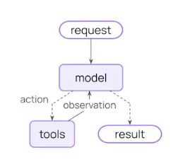
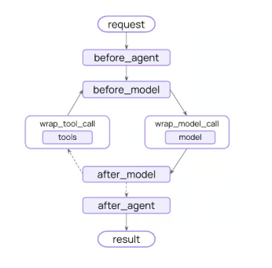

# 研究Agent设计与开发

上一节已经完成了异步任务的整体逻辑。三个异步任务都会依赖research_agent来实现具体逻辑。因此，本节内容聚焦在research_agent的设计与开发

## 1. Agent的职责

research_agent的三大职责，及其实现方式：

| 职责             | 实现方式                                                     |
| ---------------- | ------------------------------------------------------------ |
| 生成任务书和大纲 | 让大模型基于ReACT形式进行生成，以JSON格式输出最终结果        |
| 修订大纲         | 让大模型基于ReACT形式进行修改，以JSON格式输出最终结果        |
| 生成研究报告     | 让大模型基于ReACT形式逐章生成sections内容，调用工具进行保存sections到数据库中 |

> 什么是ReACT:
>
> **ReAct** 是一种让大模型交替进行**推理（Reasoning）**和**行动（Acting）**的 Agent 工作方式。
>
> 它的核心特点是：**模型不是一次性直接回答，而是边思考、边调用工具、边根据结果调整下一步操作。**
>
> ReACT和传统工作流不同：传统工作流是开发者编排步骤，ReAct 是大模型在权限范围内动态编排步骤。

## 2.Agent的设计

基于以上三大职责，本项目采用基于**研究管理智能体和信息检索智能体**的多智能体架构。

接下来，我们首选学习几种典型的多智能体结构，然后再来看本项目当中的多智能体的设计方式，以及具体实现方式。

### 2.1 多智能体的常见结构

#### 2.1.1 中心化 Supervisor / Manager-Worker 架构

该结构示意图如下：

```text
                    ┌─> Search Agent
User -> Supervisor ─┼─> Database Agent
                    ├─> RAG Agent
                    └─> Code Agent
                           |
                    Supervisor 汇总
                           |
                        Final Answer
```

由一个中心智能体负责：

- 理解用户任务；
- 拆分子任务；
- 选择子智能体；
- 收集结果；
- 汇总最终答案。

它也常被叫作：

- Supervisor 架构；
- Manager-Worker 架构；

多智能体研究通常将这种结构归为**中心化拓扑**：协作决策集中在中心智能体上，其他智能体之间通常不直接通信。

该结构的优缺点如下：

| 优点                       | 缺点                                                         |
| -------------------------- | ------------------------------------------------------------ |
| 流程容易理解               | supervisor容易成为错误决策的集中来源（因此Supervisor需要使用比较强的模型） |
| 日志追踪和故障排查比较方便 | Supervisor容易成为上下文瓶颈（Supervisor需要使用上下文窗口比较大的模型） |

#### 2.1.2 去中心化 Peer-to-Peer / Swarm 架构

该结构示意图如下：

```text
User -> Triage Agent
            |
            v
       Sales Agent <----> Support Agent
            |                   |
            v                   v
      Contract Agent      Refund Agent
```

这种结构没有固定的总指挥，每个智能体都可以把任务交给另一个智能体，不依赖统一的中央编排器，同时多个智能体共享消息上下文。

该结构的优缺点如下：

| 优点                     | 缺点                   |
| ------------------------ | ---------------------- |
| 灵活，容易动态添加新角色 | 全局任务进度不容易掌控 |
| 无中心节点瓶颈问题       | 容易互相踢皮球         |

#### 2.1.3 Router+专业Agent结构

Router 和 Supervisor 很像，但职责更轻。它通常只负责分类和路由，不负责完整规划。

```text
                     ┌─> Finance Agent
User -> Router ──────┼─> Legal Agent
                     ├─> Medical Agent
                     └─> General Agent
```

Router和Supervisor的区别为：

```text
Router：
判断“这个问题应该交给谁”。

Supervisor：
判断“任务怎么拆、先做什么、后做什么、
失败怎么办、是否继续，以及最后怎么汇总”。
```

该结构的优缺点如下：

| 优点                                                         | 缺点                                                         |
| ------------------------------------------------------------ | ------------------------------------------------------------ |
| 结构简单，容易实现                                           | 路由错误会直接影响最终结果，复杂或模糊请求难以分类；Router 的分类准确率非常关键 |
| 专业 Agent 之间相互隔离，每个Agent只做自己擅长的事情，Agent之间不互相通信 | 不擅长多个 Agent 协同任务                                    |
| 响应速度较快，一般只经历：Router 判断 → 一个 Agent 执行      | 缺少全局任务管理， 更适合简单任务                            |

### 2.2 本项目中Agent设计

接下来介绍，本项目中两个Agent的职责设计，输出方式及输出数据结构。

本项目中的两个智能体：**研究管理智能体和信息检索智能体**采用的架构为Manager-Worker架构。

#### 2.2.1 职责设计

研究管理智能体负责：

- 基于用户的问题，构建研究任务书和研究大纲，**直接以JSON格式输出**。
- 基于用户对大纲的修改意见，修改大纲，**直接以JSON格式输出**。
- 基于已确认大纲，拆解每个章节需要回答的问题。
- **将检索问题分派给信息检索智能体**。
- 整理来源、事实材料和冲突信息，写出每个章节的完整正文，**调用工具将结果保存至数据库**。

信息检索智能体负责：

- 基于主研究智能体分派的问题，构造搜索关键词。

- 使用公开互联网搜索工具发现资料来源。

- 使用网页读取工具读取关键网页正文和元数据。

- 按需使用 RAGFlow 工具检索内部知识库。

- 对来源进行去重和相关性判断。

- 从来源中提取可复核事实。

- 标注每条事实对应的来源。

- 识别不同来源之间的冲突、口径差异和不确定性。

> 小贴士：
>
> 在实际生产环境下，本项目还可以继续扩展更多智能体。拆分智能体的原则是：只有当某类任务有独立工具、独立上下文和独立输出结构时，才适合拆成单独智能体。
>
> 可扩展方向包括：
>
> - 问数智能体：面向企业内部结构化数据库，负责 SQL 生成、指标查询和数据解释。
>
> - 竞品分析智能体：专门跟踪公司、产品、融资、价格、渠道和客户案例。
>
> - 政策分析智能体：专门检索政策文件、监管动态、官方解读和政策影响。
>
> - 财务分析智能体：专门处理财报、公告、经营数据和估值指标。
>
> - 图表规划智能体：根据研究结果规划适合展示的图表类型和数据结构。

#### 2.2.2 输出方式及结构

##### 2.2.2.1 信息检索智能体

信息检索智能体输出内容，只传递给主智能体，且输出结构如下：

```json
{
    "sources": [
        {
            "source_id": "source-1",
            "title": "来源标题",
            "url": "https://example.com/source",
            "published_at": "2025-01-01",
            "source_type": "official_document",
            "summary": "该来源的主要内容摘要。"
        }
    ],
    "fact_cards": [
        {
            "fact_id": "fact-1",
            "statement": "从来源中提取出的事实陈述。",
            "source_ids": [
                "source-1"
            ],
            "confidence": "medium",
            "evidence_summary": "简要说明该事实由哪些证据支持。"
        }
    ],
    "conflicts": [
        {
            "conflict_id": "conflict-1",
            "description": "不同来源之间存在的口径差异或结论冲突。",
            "source_ids": [
                "source-1",
                "source-2"
            ],
            "severity": "medium"
        }
    ]
}
```

生成的要求：

  - sources 保存来源信息。
  - source_type可包含如下类型：official_document，industry_report, news, public_web, internal_knowledge_base, unknown等。
  - fact_cards 保存从来源中提取出的事实卡片。
  - conflicts 保存来源冲突、数据口径差异或不确定性。
  - fact_cards[].source_ids 必须能在 sources[].source_id 中找到。
  - conflicts[].source_ids 也必须能在 sources[].source_id 中找到。

##### 2.2.2.1 主智能体：生成/修订任务书和大纲

该任务**以JSON格式进行输出**，输出示例如下：

```json
{
    "research_brief": {
        "topic": "低空经济产业机会研究",
        "research_goal": "判断公司是否值得进入低空经济领域。",
        "target_audience": "公司管理层",
        "scope_summary": "聚焦中国市场、近三年政策、市场机会和进入风险。",
        "key_questions": [
            "低空经济的发展机会在哪里？",
            "哪些细分场景值得进入？",
            "主要风险是什么？"
        ],
        "assumptions": [

        ],
        "success_criteria": [
            "给出是否进入的判断。",
            "给出优先进入方向。",
            "说明主要风险。"
        ]
    },
    "outline": [
        {
            "node_id": "1",
            "title": "行业现状",
            "question": "低空经济当前发展到什么阶段？",
            "description": "分析政策、市场和产业发展情况。",
            "children": [

            ]
        },
        {
            "node_id": "2",
            "title": "机会分析",
            "question": "哪些场景最有机会？",
            "description": "分析物流、巡检、文旅、应急等应用场景。",
            "children": [

            ]
        },
        {
            "node_id": "3",
            "title": "进入建议",
            "question": "公司是否应该进入，如何进入？",
            "description": "给出进入判断、优先方向和主要风险。",
            "children": [

            ]
        }
    ]
}
```

生成的要求：

  - 顶层必须包含 research_brief 和 outline。
  - research_brief 必须包含：topic、research_goal、target_audience、scope_summary、key_questions、assumptions、success_criteria。
  - outline 必须是数组。
  - 每个 outline 节点必须包含：node_id、title、question、description、children。
  - children 没有子章节时写空数组 []。
  - 最终只能输出 JSON，不要夹杂解释文字。

##### 2.2.2.2 主智能体：生成报告中的章节内容

主智能体输出章节内容，和生成/修订大纲不同：

**不是让智能体直接输出完整的内容，而是每次写一个章节内容，然后调用工具，保存至数据库中，这避免了直接生成完整的所有章节内容再进行保存时，极易出现的JSON不合法、内容截断、部分章节丢失的问题**。

**最终报告不是从智能体一次性返回的大 JSON 解析出来的，而是后端从数据库中读取已保存的 sections/sources，再组装并渲染成 HTML**。

主智能体每次生成的章节结构如下：

```text
{
    "section_id": "1",
    "title": "行业现状",
    "summary": "本节简要说明行业当前发展阶段。",
    "body": "这里写完整章节正文，不能是提纲，不能是占位内容，长度至少 120 字符。",
    "key_findings": [
        {
            "finding_id": "finding-1",
            "claim": "低空经济仍处于政策推动和试点落地并行的早期发展阶段。",
            "source_ids": [
                "source-1"
            ],
            "confidence": "medium"
        }
    ],
    "sources": [
        {
            "source_id": "source-1",
            "title": "来源标题",
            "url": "https://example.com/source",
            "published_at": "2025-01-01",
            "source_type": "official_document",
            "summary": "该来源说明了低空经济相关政策和试点进展。"
        }
    ],
    "tables": [

    ],
    "risks": [
        {
            "risk_id": "risk-1",
            "description": "部分应用场景仍处于试点阶段，商业化节奏存在不确定性。",
            "source_ids": [
                "source-1"
            ],
            "risk_type": "uncertainty",
            "severity": "medium"
        }
    ]
}
```

  生成的要求：

  - 每次只生成一个章节的 section。
  - section_id 必须对应已确认大纲里的 node_id。
  - body 必须是完整正文，不是提纲，不能包含“待补充”“TODO”等占位内容。
  - key_findings 至少 1 条。
  - key_findings[].source_ids 必须能在 sources[].source_id 中找到。
  - risks[].source_ids必须能在 sources[].source_id 中找到。
  - 公开网页、新闻、行业报告、官方文件等来源必须提供 http:// 或 https:// URL。
  - 内部知识库来源可以没有 URL，但 source_type 要写 internal_knowledge_base。
  - tables没有就写空数组。

## 3. 编码

本项目中多Agent的代码开发，依赖LangChain公司所开发的开源框架deepagents来实现，接下来先介绍该框架，再来看如何基于该框架来完成本项目的开发。

### 3.1.DeepAgents的介绍

#### 3.1.1 和langchain、langgraph的区别

 deepagents 构建在 LangChain 的 Agent 基础：langchain.agent.create_agent：之上。

相比直接使用 `create_agent`，DeepAgents 默认集成了**任务规划、虚拟文件系统、上下文压缩、子智能体、人类审批**等高级能力，更适合复杂、多步骤、长上下文任务。

deepagents，langchain, langgraph 三者关系可以这样理解：

| 层级                  | 组件                     | 主要解决的问题                                               | 适合场景                               |
| --------------------- | ------------------------ | ------------------------------------------------------------ | -------------------------------------- |
| 应用级 harness        | DeepAgents               | 基于LangChain的基础Agent组件，添加多个高级特性，核心是加强Agent执行的可靠性 | 研究、编码、长任务、复杂任务           |
| Agent 框架            | LangChain `create_agent` | 基于LangGraph，构建model和tools之间的循环结构图，实现最基础的ReACT框架。 | 轻量工具调用 Agent、需要自定义少量能力 |
| 编排运行时（runtime） | LangGraph                | 以节点、普通边、条件边和状态的方式，定义带循环结构、可中断恢复、带状态的执行流程 | 自定义复杂流程，非简单ReACT形式        |

对本项目来说，选择 deepAgents 的原因不是“不能用 LangChain 或 LangGraph”，而是研究报告生成天然包含长任务规划、检索材料沉淀、子任务委托和上下文压缩。

#### 3.1.2 核心原理

deepagents在create_agent的基础上，添加的多项能力，都是基于**中间价机制**实现的。deepagents的额外两大核心原理，是其使用的文件系统后端，和子智能体。

##### 3.1.2.1 中间件机制

通过create_agent创建的简单agent循环，代码如下：

```python
from langchain.agents import create_agent

agent = create_agent(
    model="deepseek-chat",
    tools=[...],
    system_prompt  ="",
)
```

机制如下所示：



只有简单的model调用和tools之间的流转。

而在此基础上，create_agent还为我们提供了middleware参数，从而可以通过middleware，来加强这个循环过程，如下所示：



整个调用Agent的过程，可以在不改变model和tools的相关代码前提下，实现多处调整：

- before/after_agent：在agent调用的起始输入和终点输出，进行相关处理（切片编程思想）；
- before/after_model: 在model调用的前后，进行相关处理（切片编程思想）；
- wrap_tool/model_call: 通过handler回调的方式，拦截工具/模型执行，可以为工具执行/模型执行，添加重试，缓存，多次调用等相关逻辑（代理思想）。

另外，middleware还能够为模型额外添加其可调用的工具。

AgentMiddleware基类如下所示：

```python
class AgentMiddleware(Generic[StateT, ContextT, ResponseT]):
    """Base middleware class for an agent.

    Subclass this and implement any of the defined methods to customize agent behavior
    between steps in the main agent loop.

    Type Parameters:
        StateT: The type of the agent state. Defaults to `AgentState[Any]`.
        ContextT: The type of the runtime context. Defaults to `None`.
        ResponseT: The type of the structured response. Defaults to `Any`.
    """
    tools: Sequence[BaseTool]
    """Additional tools registered by the middleware."""

    @property
    def name(self) -> str:
        """The name of the middleware instance.

        Defaults to the class name, but can be overridden for custom naming.
        """
        return self.__class__.__name__

    def before_agent(self, state: StateT, runtime: Runtime[ContextT]) -> dict[str, Any] | None:
        pass

    async def abefore_agent(
        self, state: StateT, runtime: Runtime[ContextT]
    ) -> dict[str, Any] | None:
        pass

    def before_model(self, state: StateT, runtime: Runtime[ContextT]) -> dict[str, Any] | None:
        pass

    async def abefore_model(
        self, state: StateT, runtime: Runtime[ContextT]
    ) -> dict[str, Any] | None:
        pass

    def after_model(self, state: StateT, runtime: Runtime[ContextT]) -> dict[str, Any] | None:
        pass

    async def aafter_model(
        self, state: StateT, runtime: Runtime[ContextT]
    ) -> dict[str, Any] | None:
        pass

    def wrap_model_call(
        self,
        request: ModelRequest[ContextT],
        handler: Callable[[ModelRequest[ContextT]], ModelResponse[ResponseT]],
    ) -> ModelResponse[ResponseT] | AIMessage | ExtendedModelResponse[ResponseT]:
        pass

    async def awrap_model_call(
        self,
        request: ModelRequest[ContextT],
        handler: Callable[[ModelRequest[ContextT]], Awaitable[ModelResponse[ResponseT]]],
    ) -> ModelResponse[ResponseT] | AIMessage | ExtendedModelResponse[ResponseT]:
        pass

    def after_agent(self, state: StateT, runtime: Runtime[ContextT]) -> dict[str, Any] | None:
        pass

    async def aafter_agent(
        self, state: StateT, runtime: Runtime[ContextT]
    ) -> dict[str, Any] | None:
        pass

    def wrap_tool_call(
        self,
        request: ToolCallRequest,
        handler: Callable[[ToolCallRequest], ToolMessage | Command[Any]],
    ) -> ToolMessage | Command[Any]:
        pass


    async def awrap_tool_call(
        self,
        request: ToolCallRequest,
        handler: Callable[[ToolCallRequest], Awaitable[ToolMessage | Command[Any]]],
    ) -> ToolMessage | Command[Any]:
        pass
```

###### 1）ToDoListMiddleware

ToDoListMiddleware会在`wrap_model_call`处生效，在每次调用大模型时，都会为大模型添加一个system prompt，并为大模型添加一个`write_todos`的工具。

实现如下：

```python
class TodoListMiddleware(AgentMiddleware[PlanningState[ResponseT], ContextT, ResponseT]):
        def wrap_model_call(
        self,
        request: ModelRequest[ContextT],
        handler: Callable[[ModelRequest[ContextT]], ModelResponse[ResponseT]],
    ) -> ModelResponse[ResponseT] | AIMessage:
        """Update the system message to include the todo system prompt.

        Args:
            request: Model request to execute (includes state and runtime).
            handler: Async callback that executes the model request and returns
                `ModelResponse`.

        Returns:
            The model call result.
        """
        if request.system_message is not None:
            new_system_content = [
                *request.system_message.content_blocks,
                {"type": "text", "text": f"\n\n{self.system_prompt}"},
            ]
        else:
            new_system_content = [{"type": "text", "text": self.system_prompt}]
        new_system_message = SystemMessage(
            content=cast("list[str | dict[str, str]]", new_system_content)
        )
        return handler(request.override(system_message=new_system_message))

    async def awrap_model_call(
        self,
        request: ModelRequest[ContextT],
        handler: Callable[[ModelRequest[ContextT]], Awaitable[ModelResponse[ResponseT]]],
    ) -> ModelResponse[ResponseT] | AIMessage:
        """Update the system message to include the todo system prompt.

        Args:
            request: Model request to execute (includes state and runtime).
            handler: Async callback that executes the model request and returns
                `ModelResponse`.

        Returns:
            The model call result.
        """
        if request.system_message is not None:
            new_system_content = [
                *request.system_message.content_blocks,
                {"type": "text", "text": f"\n\n{self.system_prompt}"},
            ]
        else:
            new_system_content = [{"type": "text", "text": self.system_prompt}]
        new_system_message = SystemMessage(
            content=cast("list[str | dict[str, str]]", new_system_content)
        )
        return await handler(request.override(system_message=new_system_message))
```

###### 2）FileSystemMiddleware

`FileSystemMiddleware`实现了wrap_model_call和wrap_tool_call。

在wrap_model_call当中，FileSystemMiddleware会在原SystemPrompt的基础上面，添加上让模型使用文件系统相关工具：

```textile
## Following Conventions

- Read files before editing — understand existing content before making changes
- Mimic existing style, naming conventions, and patterns

## Filesystem Tools `ls`, `read_file`, `write_file`, `edit_file`, `glob`, `grep`

You have access to a filesystem which you can interact with using these tools.
All file paths must start with a /. Follow the tool docs for the available tools, and use pagination (offset/limit) when reading large files.

- ls: list files in a directory (requires absolute path)
- read_file: read a file from the filesystem
- write_file: write to a file in the filesystem
- edit_file: edit a file in the filesystem
- glob: find files matching a pattern (e.g., "**/*.py")
- grep: search for text within files

## Large Tool Results

When a tool result is too large, it may be offloaded into the filesystem instead of being returned inline. In those cases, use `read_file` to inspect the saved result in chunks, or use `grep` within `{large_tool_results_prefix}/` if you need to search across offloaded tool results and do not know the exact file path. Offloaded tool results are stored under `{large_tool_results_prefix}/<tool_call_id>`.
```

另外，还会将过长的消息进行裁剪，然后再来进行模型调用。

同样，在wrap_tool_call中，该middleware也会对工具产生的消息进行裁剪，裁剪后的消息会放到文件系统中，并告知模型，可以通过读取文件的方式，来获取到消息内容。

###### 3）SubAgentMiddleware

`SubAgentMiddleware`实现了wrap_model_call，在每次调用模型前，会为模型添加上新的system_prompt： 告诉模型当前有哪些子agent可以使用，每个子agent的描述信息。

SubAgentMiddleware中，为主智能体提供子智能体调用的方式，是给主智能体新添加了一个task的tool，这个tool的参数包含了：调用的子智能体的名称，和调用信息。

```python
class SubAgentMiddleware(AgentMiddleware[Any, ContextT, ResponseT]):
        def __init__(
        self,
        *,
        backend: BackendProtocol | BackendFactory,
        subagents: Sequence[SubAgent | CompiledSubAgent],
        system_prompt: str | None = TASK_SYSTEM_PROMPT,
        task_description: str | None = None,
        state_schema: type | None = None,
    ) -> None:
        """Initialize the `SubAgentMiddleware`."""
        super().__init__()

        if not subagents:
            msg = "At least one subagent must be specified"
            raise ValueError(msg)
        self._backend = backend
        self._subagents = subagents
        self._state_schema = state_schema
        subagent_specs = self._get_subagents()
        self.subagent_names: frozenset[str] = frozenset(spec["name"] for spec in subagent_specs)
        """Declared subagent names. Public so streamers can discover them
        without introspecting the `task` tool's closure."""

        task_tool = _build_task_tool(subagent_specs, task_description)

        # Build system prompt with available agents
        if system_prompt and subagent_specs:
            agents_desc = "\n".join(f"- {s['name']}: {s['description']}" for s in subagent_specs)
            self.system_prompt = system_prompt + "\n\nAvailable subagent types:\n\n" + agents_desc
        else:
            self.system_prompt = system_prompt

        self.tools = [task_tool]
```

###### 4）其他Middleware

create_deep_agent还添加了如下middleware，仅做了解:

- SummarizationMiddleware

- PatchToolCallsMiddleware

- 其他。。。

##### 3.1.2.2 文件系统后端

FileSystemMiddleware依赖文件系统后端来进行文件读写。文件系统后端是实现以下接口的类：

| 方法                                | 功能        |
| --------------------------------- | --------- |
| ls                                | 列出目录内容    |
| read                              | 分页读取文件    |
| write                             | 创建新文件     |
| edit                              | 精确字符串匹配   |
| grep                              | 文本搜索      |
| glob                              | 通配符匹配文件   |
| upload_files() / download_files() | 批量上传/下载文件 |

有如下的文件系统后端：

- StateBackend：存在Langgraph的Agent State中，在一次对话线程内持久，线程间不共享；该实现为默认实现。

- FileSystemBackend: 直接读写真实磁盘文件系统、也可以设置虚拟化路径，将路径约束在指定目录下面；

- StoreBackend：文件存在Langgraph的Base Store当中，生产环境替代本地磁盘。容器重启、横向扩容、本地磁盘不可依赖时，用 StoreBackend 接 Mongo/Postgres/Redis/云存储背后的 LangGraph store。

- Compositebackend：可以按路径前缀，路由到不同的后端。

注意：子智能体的FileSystemMiddleware使用的是主agent同一个backend实例。这意味着子智能体操作的文件和主智能体是同一个文件空间。

下面以使用skills作为例子，来讲解StateBackend、FileSystemBackend和StoreBackend的不同：

使用StateBackend:

```python
  from deepagents import create_deep_agent
  from deepagents.backends.utils import create_file_data

  agent = create_deep_agent(
      model="openai:gpt-4.1-mini",
      tools=[],
      skills=["/skills/project/"],
  )

  skill_md = """---
  name: web-research
  description: 用于公开资料检索、来源整理和结论归纳
  ---

  # Web Research

  当用户要求调研某个主题时：
  1. 明确问题范围
  2. 收集来源
  3. 整理关键事实
  4. 输出带来源的总结
  """

  result = agent.invoke(
      {
          "messages": [
              {"role": "user", "content": "帮我调研一下新能源汽车行业趋势"}
          ],
          "files": {
              "/skills/project/web-research/SKILL.md": create_file_data(skill_md),
          },
      },
      config={
          "configurable": {
              "thread_id": "demo-statebackend-skills"
          }
      },
  )
```

**注意**：使用StateBackend的时候，必须在invoke时，传入一个files key，作为skills的具体内容信息，仅在构建create_deep_agents时，传入skills目录，agent在运行过程中，无法读取到具体的skills内容。

使用FileSystemBackend:

```python
  from deepagents import create_deep_agent
  from deepagents.backends import FilesystemBackend

  backend = FilesystemBackend(
      root_dir="/home/m1881/pycharm_projects/DeepResearch"
  )

  agent = create_deep_agent(
      model="openai:gpt-4.1-mini",
      tools=[],
      backend=backend,
      skills=["/agent_skills/"],
  )

  result = agent.invoke(
      {
          "messages": [
              {"role": "user", "content": "帮我调研一下新能源汽车行业趋势"}
          ],
      },
      config={
          "configurable": {
              "thread_id": "demo-filesystembackend-skills"
          }
      },
  )
```

**注意**：使用FileSystemBackend的时候，在invoke，无需传入files，因为FilesystemBackend可以真实读取磁盘上面文件内容。

使用StoreBackend:

```python
  from deepagents import create_deep_agent
  from deepagents.backends import StoreBackend
  from langgraph.store.memory import InMemoryStore

  store = InMemoryStore()

  skill_md = """---
  name: web-research
  description: 用于公开资料检索、来源整理和结论归纳
  ---

  # Web Research

  当用户要求调研某个主题时：
  1. 明确问题范围
  2. 收集来源
  3. 整理关键事实
  4. 输出带来源的总结
  """

  namespace = ("user-123", "agent-files")

  # 先把 skill 文件写入 LangGraph store
  store.put(
      namespace,
      "/skills/project/web-research/SKILL.md",
      {
          "content": skill_md,
          "encoding": "utf-8",
      },
  )

  backend = StoreBackend(
      store=store,
      namespace=lambda rt: namespace,
  )

  agent = create_deep_agent(
      model="openai:gpt-4.1-mini",
      tools=[],
      backend=backend,
      store=store,
      skills=["/skills/project/"],
  )

  result = agent.invoke(
      {
          "messages": [
              {
                  "role": "user",
                  "content": "帮我调研一下新能源汽车行业趋势，并整理成简短报告",
              }
          ],
      },
      config={
          "configurable": {
              "thread_id": "demo-storebackend-skills"
          }
      },
  )
```

##### 3.1.2.3 子智能体

在deepagents中，子智能体会作为一个特殊的task/tool，给到主智能体去调用。

子智能体的定义，有两种方式：

可通过声明式的方式来进行定义：

```python
import os
from typing import Literal

from deepagents import create_deep_agent
from tavily import TavilyClient

tavily_client = TavilyClient(api_key=os.environ["TAVILY_API_KEY"])


def internet_search(
    query: str,
    max_results: int = 5,
    topic: Literal["general", "news", "finance"] = "general",
    include_raw_content: bool = False,
):
    """Run a web search"""
    return tavily_client.search(
        query,
        max_results=max_results,
        include_raw_content=include_raw_content,
        topic=topic,
    )


research_subagent = {
    "name": "research-agent",
    "description": "Used to research more in depth questions",
    "system_prompt": "You are a great researcher",
    "tools": [internet_search],
    "model": "openai:gpt-5.4",  # Optional override, defaults to main agent model
}
subagents = [research_subagent]

agent = create_deep_agent(
    model="google_genai:gemini-3.5-flash",
    subagents=subagents,
)
```

可通过预编译的CompiledSubAgent来传入：

```python
from deepagents import create_deep_agent, CompiledSubAgent
from langchain.agents import create_agent

# Create a custom agent graph
custom_graph = create_agent(
    model=your_model,
    tools=specialized_tools,
    prompt="You are a specialized agent for data analysis..."
)

# Use it as a custom subagent
custom_subagent = CompiledSubAgent(
    name="data-analyzer",
    description="Specialized agent for complex data analysis tasks",
    runnable=custom_graph
)

subagents = [custom_subagent]

agent = create_deep_agent(
    model="google_genai:gemini-3.5-flash",
    tools=[internet_search],
    system_prompt=research_instructions,
    subagents=subagents
)
```

也可以传入其他langgraph构建的图，只需要保证图的状态当中有message键即可。

#### 3.1.3 核心价值

deepagents 对本项目的价值主要体现在三个方面。

第一，多智能体开发更自然。官方 Subagents 文档说明，deepagents 可以通过 `subagents` 参数配置自定义子智能体，主智能体通过内置 `task` 工具委托任务。

子智能体适合处理会污染主上下文的多步骤任务、需要专门工具的任务，或者需要不同模型能力的任务。本项目正好把“研究管理”和“信息检索”拆开：主智能体负责研究策略和章节写作，检索子智能体负责搜索、网页读取、RAGFlow 检索和事实整理。

第二，规划能力更适合长任务。研究报告不是一次问答，而是“理解任务 -> 设计大纲 -> 拆解章节 -> 检索证据 -> 写正文 -> 保存结果”的链路。

deepagents通过ToListMiddleware中间件所配置的 `write_todos` 规划工具，可以让 Agent 在执行前维护任务清单，并随着缺失章节、检索结果或用户补充要求调整计划。

第三，上下文管理更稳定。官方 Context Engineering 文档把 文件 offloading、summarization 和 subagent isolation 都列为长任务上下文管理机制。对研究场景来说，搜索结果、网页正文、事实卡片、引用来源和章节草稿都可能很长。如果全部放在消息历史里，模型容易遗漏章节、混淆来源，甚至把搜索摘要当事实。使用虚拟文件系统和子智能体隔离后，主智能体可以只接收整理后的结论和证据结构。

### 3.2 基于deepagents的编码

